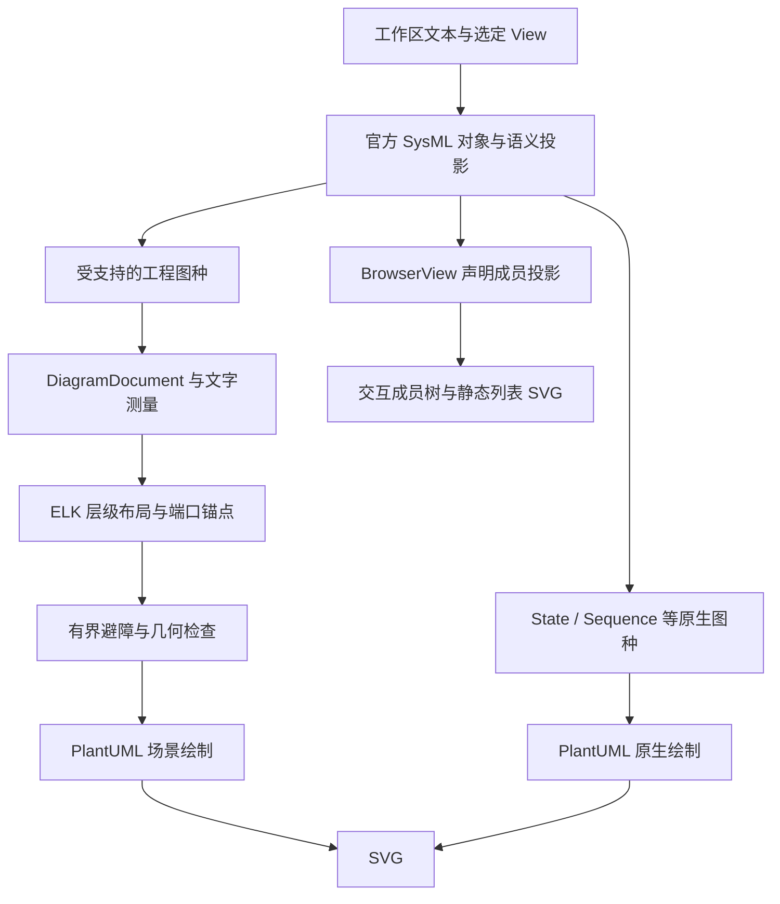

# 工程视图与 Layout 增强

平台将模型语义投影、布局计算与绘图分开。连接的端点、包含上下文与需求引用来自官方对象；布局锚点、避障矩形和坐标不写回 SysML 模型。

## 为什么引入独立布局层

当视图包含多个根、嵌套部件、内外端口和长中文标签时，读者需要看清“元素属于谁”和“连接实际接到哪里”。只调整图形方向、间距或皮肤不能表达全部工程布局约束。增强层把这些约束放到可检查的数据结构和算法中：先计算节点与标签尺寸，再安排层级及端口位置，最后对冲突线路做有界避障并检查几何。

用使用者的话说，模型仍由你编写和验证，平台负责把模型中已有的内容排成更容易阅读的图。用实现术语说，官方语义投影生成 `DiagramDocument`，ELK 与图种专用几何处理生成 `layoutScene`，PlantUML 的 UGraphic/ImageBuilder 绘图 API 输出 SVG。增强的是布局能力，PlantUML 仍参与最终绘制。

## 三种呈现路径



图中“官方对象”提供身份、归属和关系事实；布局层只决定展示坐标。工作台以官方语法／语义校验通过为生成视图的前置条件。共享绘图接口的调用者仍需检查 `ok`、diagnostics 和所需模型关系是否在投影范围内，不能把非空 SVG 当作完整验收。

增强路径包含以下处理：

1. **按图种投影**：保留声明元素、连接端点、包含上下文和支持的需求引用，区分图形身份与模型身份。
2. **测量与排列**：根据文字测量计算卡片、端口标签和容器留白，使用 ELK 安排层级、多根及复合结构。
3. **端点与避障**：计算容器端口的内外连接锚点；对存在障碍冲突的线路修正路径，保持声明端点及容器上下文。端口左右排列是布局偏好，不代表普通 connection 的物理流向。
4. **检查后绘制**：检查端点附着、图元数量、正交性及相关重叠／越界；返回几何质量、版本和 hash，供诊断和回归复核。hash 标识几何结果，不证明工程正确性。

## 各类视图的能力范围

| 视图 | 当前能力 | 边界 |
| --- | --- | --- |
| General / 需求 | 多根卡片、成员、类型、继承及支持的 require/assume 引用；中文测量、质量检查 | 不承诺所有专门关系均有自定义投影；未支持情况保留明确原因 |
| Interconnection | 复合容器、端口内外锚点、多根/跨根连接、正交避障 | 不承诺任意图无交叉；不绘制模型未声明的物理流向 |
| Action | 受支持的动作和 succession 正交布局 | 复杂控制流可能采用原生路径 |
| State / Sequence | 官方原生图种、统一皮肤和错误识别 | 不将简单样例外推为全语义覆盖 |
| Browser | 声明成员树、展开折叠及静态列表 SVG | 不沿 typing 重复展开；不是可拖拽的连接拓扑图 |

工作台及 AI 回答使用同一 viewport；BrowserView 随实际能力同步 Teacher 提示。Geometry/Grid 的标准库合法性与渲染支持分别说明。

BrowserView 按 `expose` 选出成员树根，并沿声明归属展开；不会沿 typing、import 或连接目标递归复制整棵树。匿名连接等可见声明保留在所属成员下。它适合阅读“模型声明了哪些成员”，连接拓扑应选择相应工程视图。GeometryView 和 GridView 仍是合法标准 View，但当前没有其专用呈现。

## 在工作台体验

下面的模型已用于浏览器复验。GeneralView 展示两个根及车辆系统的子成员，BrowserView 展示同一组声明成员，便于比较图形阅读与成员浏览。`frame` 是保留字，作为名称时使用单引号。

```sysml
package UIProbe {
  part def '车辆系统' {
    part 'frame';
    part battery;
  }
  part def Controller;
  view browser : StandardViewDefinitions::BrowserView {
    expose '车辆系统';
    expose Controller;
  }
  view general : StandardViewDefinitions::GeneralView {
    expose '车辆系统';
    expose Controller;
  }
}
```

点击“生成视图”，通过官方校验后在 view 选择器中切换 `general` 和 `browser`。图形使用适应、缩放及全屏工具；成员树使用展开／折叠。Teacher 回答中的完整候选也可预览视图，应用到编辑器仍通过复制粘贴完成。

复杂回归模型可直接从 [多根互连](scripts/fixtures/plantuml-view-regressions/multiroot/InterconnectionView.sysml)、[复杂需求](scripts/fixtures/plantuml-view-regressions/complex-requirements.sysml)、[Browser 成员树](scripts/fixtures/plantuml-view-regressions/drone-browser.sysml) 开始。它们是软件验收夹具，不是实际产品的工程设计证据。

## 预算、失败与原生路径

| 范围 | 当前实现限制 |
| --- | --- |
| 增强布局输入 | 最多 200 个节点、1200 个端口、800 条边 |
| 布局并发 | 每个服务进程最多两个布局 Worker，满载返回忙碌错误 |
| 单 Worker | V8 老生代堆上限 256 MB，不是整个进程总内存上限 |
| 布局计算 | ELK、避障及几何检查共用最多 10 秒，受剩余渲染预算进一步约束；不代表整个验证／渲染请求在 10 秒内完成 |
| Browser 投影 | 最多 1000 个元素；根深度为 0，最大深度为 32 |

增强布局的无效端点、超限、预算耗尽或几何失败会返回错误，不通过删掉元素或关系来制造成功。尚未覆盖的语义可能走带原因的原生路径；这是能力选择，不表示增强布局失败后可无条件忽略错误。

共享服务参数 `layoutOptimization: { mode: 'off' }` 可显式采用原生路径，其资源范围与增强布局不同；平台界面没有承诺提供这个开关。当前没有拓扑图折叠、根分页、固定节点、增量重排或任意图零交叉保证。Browser 的展开折叠仅适用于成员树。

## 验证

```powershell
npm.cmd ci
npm.cmd run setup:official-validator
npm.cmd run build:teacher-agent
npm.cmd run typecheck:web
npm.cmd test
```

推荐使用已构建的 Validator 容器测试真实字体和 SVG。将 `LAYOUT_VALIDATOR_URL` 和 `BROWSER_VALIDATOR_URL` 设置为该服务实际地址后执行 `npm.cmd run test:diagrams`；不设置时使用本地 Java 和官方缓存。Windows 本地路径可通过 `SYSML_OFFICIAL_JAR`、`SYSML_LIBRARY_PATH`、`GRAPHVIZ_DOT` 配置。

例如，使用默认 Core Validator 的本地地址：

```powershell
$env:LAYOUT_VALIDATOR_URL = 'http://localhost:9090'
$env:BROWSER_VALIDATOR_URL = 'http://localhost:9090'
npm.cmd run test:diagrams
```

这些地址仅用于连接测试服务；实际端口以本地 Compose 映射为准。字体和 SVG 的运行检查见 `npm.cmd run test:plantuml-runtime`。

专项验证包括独立声明的端点 oracle、General 44 节点/87 端口/53 边、复杂需求 89 节点/150 边、多根 1～33、错误语法、预算拒绝、几何损坏、Worker 取消与资源恢复。它们证明所测模型与路径，不代替 Chrome 中的可读性和交互验证。原有互连图的 29 条定义级线路与新上下文展开的 162 条关系是不同表示，测试分别保留。

[初始工程验证](RENDERING_VALIDATION.md) 保留首次失败及修正记录；[后续应用内浏览器复验](SYSML_NAMING_VALIDATION.md) 覆盖中文 GeneralView、Browser 展开折叠、缩放／全屏、回答预览及候选重新校验。Chrome 扩展链路未恢复，修正后的 Teacher 视图能力问答因周 token 配额耗尽而未生成答案；这些剩余项不应被服务端测试或前两轮真实回答覆盖。没有据此声称全面浏览器验收、生产部署或相对旧版本的性能提升。

语义依据为固定官方运行时的 StandardViewDefinitions.sysml 及官方解析对象。规范入口：[OMG SysML 2.0](https://www.omg.org/spec/SysML/2.0)，运行时来源：[Pilot 2026-04](https://github.com/Systems-Modeling/SysML-v2-Pilot-Implementation/releases/tag/2026-04)。测试夹具是功能回归模型，不作为真实车型或产品设计的工程证据。

## 运行架构影响

共享绘图包取代 Validator 内的重复实现，保留旧 JS 导出作为兼容入口。Teacher 只同步视图能力知识和回答视图转发；没有新增 Worker、LLM Schema、业务状态、候选发布或 Validator 判定。资源策略和 Core/Full 启动契约保持原有边界。

这里没有增加 Teacher 的 AI Worker；布局内部使用的是 Node.js 计算 Worker。绘图服务与 Validator 同进程部署，因此 Core 和 Full 都能使用工程布局，布局本身不消耗模型 token。

实现入口见 [共享服务](packages/sysml-plantuml-service/README.md)、[视图调度](packages/sysml-plantuml-service/service.js)、[布局计算与检查](packages/sysml-plantuml-service/diagram-layout.js)、[General／需求几何](packages/sysml-plantuml-service/general-layout.js) 和 [正交路由](packages/sysml-plantuml-service/orthogonal-router.js)。
